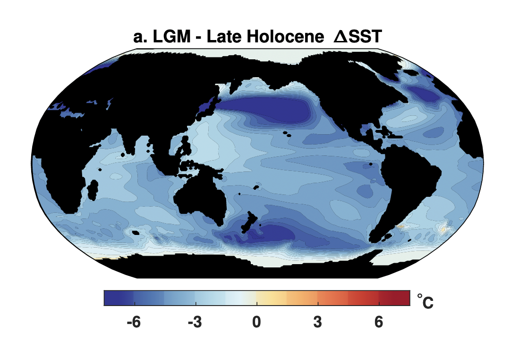
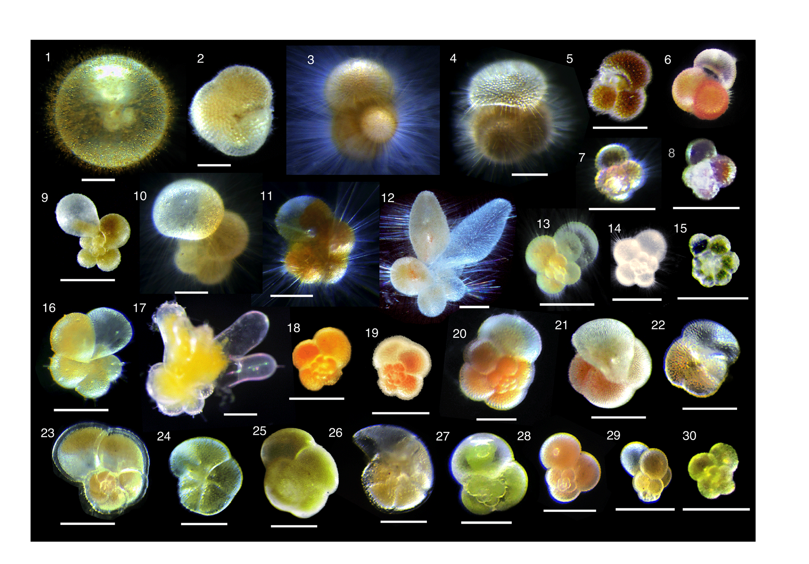
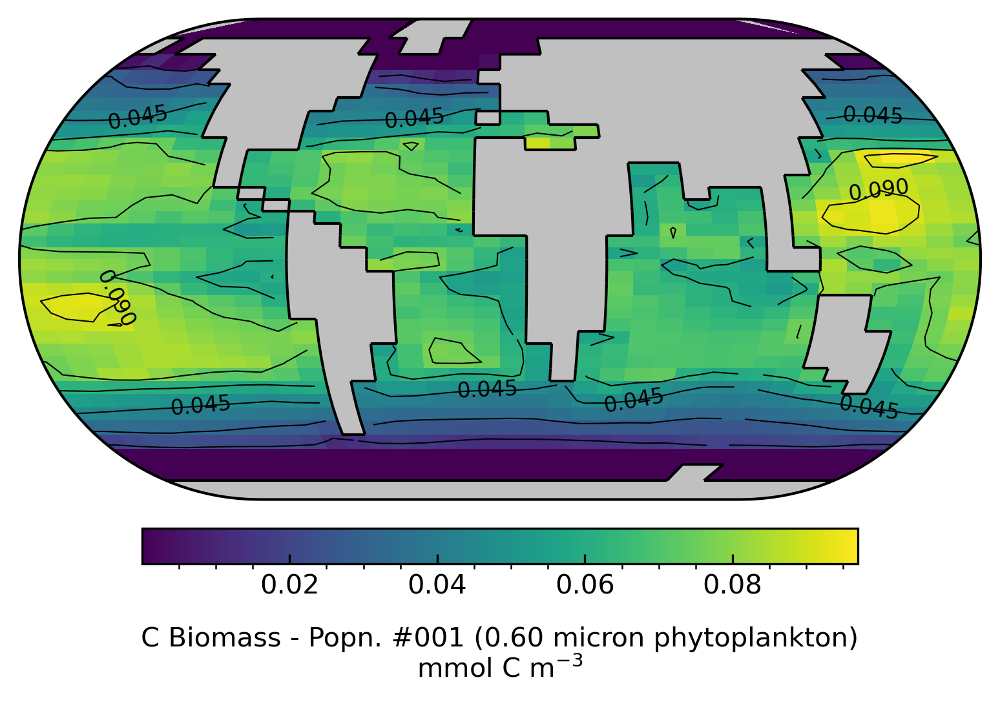

## Biography 🌊

I am a scientist studying marine ecology and climate change. I received my Bachelor's and Master's degrees in China and completed my PhD study in Bristol, UK. I am now a Senior Research Associate at the [University of East Anglia](https://www.uea.ac.uk/about/school-of-environmental-sciences).

This website is pretty much an archive of my random thoughts, including programming, science, tennis, or even music (ME playing guitar on the RHS!).

## Research 🔬

### Climate change from past to future

The Earth is warming. But the climate change in the geological history is not new since the very beginning. One of my research topic is therefore to understand the climate change in the past and its mechanism.

The recent geological epoch (Quanternary) is one of my main focus because of its deterministic feature and data availability. It is characterized with periodic transition between warm (interglacial) and cold (glacial) climate because of the changing eccentricity, obliquity and precession. The Last Galcial Maximum (~21,000 years BP) is the latest cold age (figure to the left, Tierney et al. 2020) with more ice sheets in the polars and the sea surface temperature averagely 2 to 4 degree lower than the present day. But we still have no idea why the climate change happened!

### Marine plankton and biogeochemical cycles

<figure>
	
</figure>

Marine plankton live in the surface ocean. They are tightly related with the cliamte topic because they regulate carbon (and many other element) cycles. Among tens of thousands of plankton species, I study planktic foraminifera the most (so far). Planktic foraminifera are a group of marine zooplankton with calfification trait. Their first appearance in the Earth history is estimated in the mid-Jurassic (160 Ma). These shells gradually sink onto the marine sediment, and provide the best microfossil record on Earth. Geochemisits use their fossils to measure past temperature ($\delta^{18}O$, Mg/Ca), nutrient (I/Ca), ocean productivity, whilst I tend to study their ecology change (e.g., [Ying et al., 2024](https://www.nature.com/articles/s41586-024-08029-0))

### Earth System Model

Earth system model is my primary research tool. I mostly use [cGENIE.muffin](https://www.seao2.info/mymuffin.html) with most focuses on the ocean ecosystem and biogeochemistry. I have developed its ecosystem component and added more foraminifer functional groups into the model. You can view the [published paper on GMD](https://gmd.copernicus.org/articles/16/813/2023/gmd-16-813-2023.html) for more details about this model.

I have developed a Python package to visualise cGENIE output, named as `cgeniepy`. An example here is how I use the package to plot the carbon biomass of phytoplankton population. More can be found in [my github repository](https://github.com/ruiying-ocean/cgeniepy).
