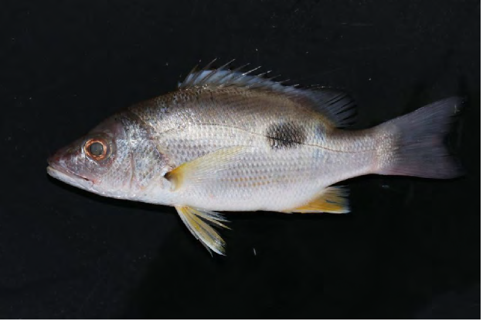
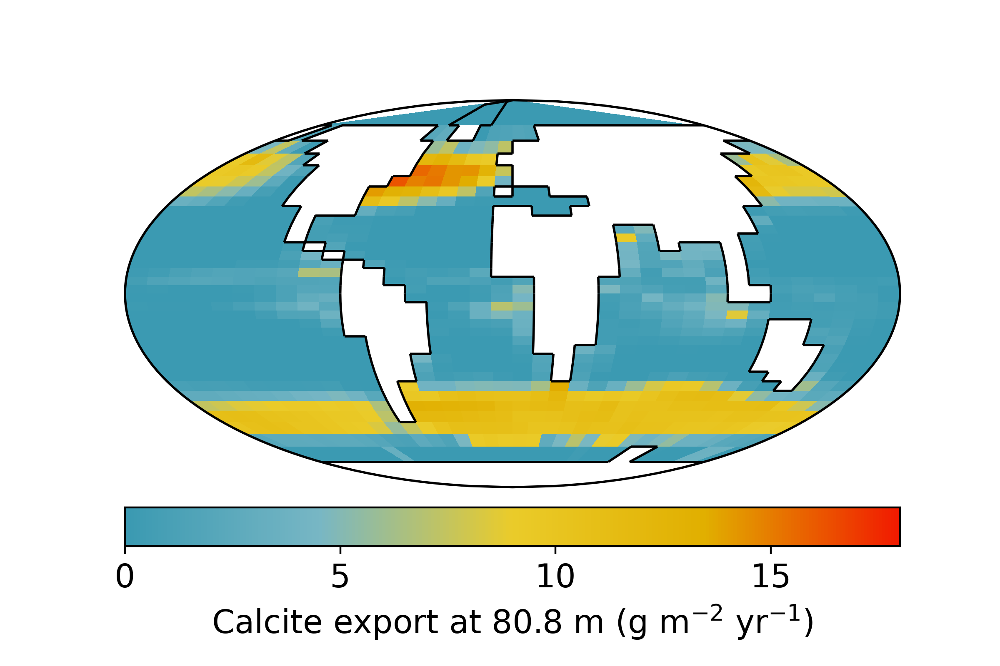

## Biography 🌊

I am a Chinese PhD student at [School of Earth Sciences, University of Bristol](http://www.bristol.ac.uk/earthsciences/). I studied in Yangling and Guangzhou before my PhD. I have a variety of interests, from programming to fitness/tennis, from natural sciences to music (ME playing guitar on the RHS!).

This website is a combination of my blog records and a brief introduction of my research. Check [my CV](https://www.dropbox.com/scl/fi/2vtdcs1xo212kcqows4fj/CV-Rui-Ying.pdf?rlkey=cwth2c4g2j3tnmmqf3eiwuw71&dl=0) if you want to find more about me.

## Research 🔬

I study climate, marine ecology and evolution, and biogeochemical cycles. The main interest of mine is to understand the fundamental mechanisms of the complex Earth system. For example, why (marine) species become today's shape and have today's functions? Why some areas have more species than the other? Broadly speaking, what controls the fate of lives since its beginning, is it deterministic or stochastic? Below is the introduction of my research object and tool.

### Coastal marine ecosystem
Before I dive in to the "big questions", I studied the seasonal variation of marine food web in North South China Sea 2017-2018. This is a coastal sea affected by the East Asia monsoon system. In the winter, the strong northeasterly wind mixed waters and supplied sufficient nutrient for plankton (high nitrate and Chl-a). However, the total biodiversity is lowest likely due to the narrow temperature window for organisms. Differently, in the summer, another phytoplankton bloom associated with high total pelagic biomass, average trophic level (caused by increasing carnivorous fish) and biodiversity was found. Spring is an interesting time when both temperature and nutrient were limited. This minimises the food resource and makes species to seek different food sources. Thus, we observed more benthic fish in the upper layer, but the most abundance zooplankton due to the less grazing pressure. These observations are based on intense field work including pair trawl, bottom trawl, plankton net, water sampling, and carbon and nitrogen stable isotopes measurement in my 3-year Master.

<figure>
	
</figure>

### Planktonic Foraminifera

<figure>
	
</figure>

Planktic foraminifera are a group of marine zooplankton living in the surface ocean. Their first appearance in the Earth history is estimated in the mid-Jurassic (160 Ma). All the foraminifera have calcareous shells, but some species have evolved unique features (e.g., use algae as symbionts) through the time (See the figure, from Takagi et al. 2019, Bigeosciences). These shells sink onto the marine sediment, and provide the best microfossil record so far. Geochemisits use their fossils to measure past temperature ($\delta^{18}O$, Mg/Ca), nutrient (I/Ca), ocean productivity, whist I tend to study their distribution and biodiversity change (Ezard et al. 2011).

Foraminifera as carbonate producer also influence the modern carbon cycle by regulating the carbonate pump. Because the precipitation of calcite reduces the alkalinity in the surface ocean, which hinders the ocean abosrbing more carbon dioxide from the atmosphere. Current estimation of foraminiferal contribution on carbonate production is >20%, but more figure is urgently needed. Also foram's role in the carbon cycle is largely unkown depending on the validity of ballast hypothesis.

### Earth System Model

cGENIE is an Earth System Model with intermediate complexity (EMIC), with most focuses on the ocean biogeochemistry. It is my main tool to explore foraminifer and ecosystem. Recently I added more foraminifer functional groups into the model. You can view the [published paper on GMD](https://gmd.copernicus.org/articles/16/813/2023/gmd-16-813-2023.html) for more details about this model.

### Last Glacial Maximum and plankton niche

The climate of our Earth is naturally cycling from warm (interglacial) and cold (glacial) ages, because of the changing eccentricity, obliquity and precession. The present day is now in an interglacial age, and the Last Galcial Maximum (~21,000 years BP) is the closet cold age to us (figure to the left, Tierney et al. 2020). There was more ice sheets in the polars and the sea surface temperature was averagely 2 to 4 degree lower than the Holocene (the current geological epoch).

I studied the ecological niche of foraminifera in the LGM based on cGENIE model, and test it in several data compilations. These evidence suggest that some foraminifera have changed their optimal niche in response to the past climate changes, therefore showing the sign of adaptive behaviour. These results can be found in [my preprint](https://doi.org/10.31223/X5D10G).
