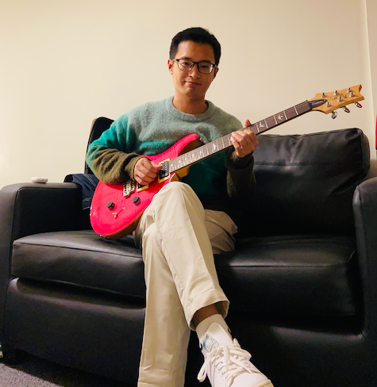

## Biography 🌊

I am a scientist studying marine ecology and climate change. I received my Bachelor's and Master's degrees in China and completed my PhD in Bristol, UK. I am now a Senior Research Associate at the [University of East Anglia](https://www.uea.ac.uk/about/school-of-environmental-sciences).

My work combines Earth system models with the geological record to understand how the ocean and its plankton respond to climate change. You can read more about it on my [**Research**](/research/) page.

This website is mostly an archive of my random thoughts — programming, science, tennis, and the occasional bit of music.
