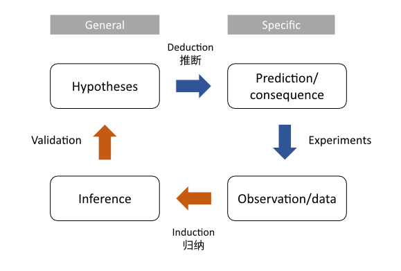

## Basics

### Conditional probability

Conditional probability is the probability of an event given something already happened. It is a joint probability divdied by marginal probability.

$$
P(A|B) = \frac{P(AB)}{P(B)}
$$

The `|` means "given" [^a].

[^a]: 图像化理解：在B的圈子里，和A重叠的概率

### Law of total probability

$$
P(Y) = P(X|Y) + P(!X|Y)= \frac{P(XY)}{P(Y)} + \frac{P(!XY)}{P(Y)}
$$

### Bayesian theorem

Clearly $P(A|B)$ has some relationship with $P(B|A)$, because they share the common part $P(AB)$.

$$
P(A|B) = \frac{P(AB)}{P(B)}
$$

$$P(B|A) = \frac{P(BA)}{P(A)}
$$

$$ P(BA) = P(AB) = P(B|A)P(A) = P(A|B)P(B)
$$

Therefore,

$$
P(A|B) = \frac{P(B|A)P(A)}{P(B)}
$$

If we use the total probability for our denominator, it becomes

$$
P(A|B) = \frac{P(B|A)P(A)}{P(B|A)P(A) + P(B|!A)P(!A)}
$$

This euqation is called Bayesian theorem and it means if you are given something like P(A|B), you can find its reverse P(B|A) (i.e., the Bayesian inference, see the next block).

## Bayesian inference and science

### Bayesian inference

Based on the theorem, if we set B the given event as our collected data, A the thing we want to test (or a hypothesis), we change the equation into:

$$
Pr(H_i|data) = \frac{\color{pink}{Pr(data|H_i)}\color{steelblue}Pr(H_i)}{\sum_{j=1}^n \color{pink}{Pr(data|H_i)}\color{steelblue}Pr(H_i)}
$$

$\color{pink}{Pr(data|H_i)}$ is called $\color{pink}{likelihood}$, $\color{steelblue}Pr(H_i)$ the $\color{steelblue}{prior}$ probability, $\color{blue}{Pr(H_i|data)}$ refers to $\color{blue}{posterior}$ probability.

If the probability is discrete, we use Pr(); otherwise, we use P() to represent the PDF distribution (and use integration to replace sum).

$$
P(\theta|data) = \frac{\color{pink}{P(data|\theta)}\color{steelblue}P(\theta)}{\int \color{pink}{P(data|\theta)}\color{steelblue}P(\theta)d\theta}
$$

The $\theta$ here refers to the single parameter in our PDF distribution. If there are two or more, simply change it.

You might find the former one is regrading to hypothesis test, while the later one refer to parameter estimation. And due to its special feature, **Bayesian inference always gives distribution for parameters**. Thus the point estimation is not existing here and the interval estimation will be very natural.

In conclusion, Bayesian inference does work like below:

> Initial belief + New Data = Updated belief

### What is science?
Science refers to a system of acquiring knowledge and update our cognition. The scientific method consists of *induction* and *deduction* (see the figure below).

