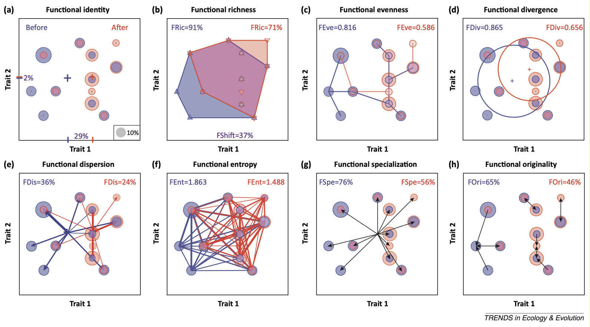

<!--more-->
## Introduction

Functional diversity is a component of multifacet diversity concept. Differing from species perspective, it is based on functional trait, i.e., morphological, physiological, phenological, behavioral,  or life history features that govern the functional role of organisms.

## Quantification of functional space

### CWM (community weighted mean)

The index corresponds, for each trait (either quantitative or qualitative), to the average trait values in a community weighted by the species’ relative abundances.

### Sum of branch length (Petchey and Gaston, 2006)

species x traits -> distance matrix -> cluster/dendrogram -> sum of the branch lengths; get species in each group

### Trait space

Use trait as dimension, plot each species in the functional space. The rest of calculation is same to the trait-distance based method. The trait based method has two limitations: (1) limited tratis can be used, usually visuliased as 2D; (2) trait can be co-varied, i.e., not linearly independent. These two can be solved using PCoA.

### Trait Distance based

**Species (sample) x trait (variable)** data frame to calculate species distance (or dissimilarity) matrix (i.e. how species is similar to each other). Then based on this dissimilarity matrix, use PCoA to decrease the dimension. The PCs will become the new coordinate system (similar to direct trait space but using linear combination of those trait), and each species will have a position (e.g., i,j,k) in this system.

The essence of **site (assemblage) x species** data is to describe the composition of each assemblage. We can plot each species (coloured/groupped by assemblage, abundance/biomass as dot size) in the new coordinate system and then do some quantification. The abundance data basically determines the centre of gravity (or centroid) within each assemblage. The group can be temporal (before and after) or spatial (different sites).

The following is a table of listed functional indices and important term.

| Functional indices        | Definition                                                   | Reference                    | Ecological meaning                                           |
| ------------------------- | ------------------------------------------------------------ | ---------------------------- | ------------------------------------------------------------ |
| Centroid                  | The biomass-weighted trait value                             |                              |                                                              |
| Functional richness       | Area of the convex hull                                      | Villéger et al. 2008         | Functional niche size, <u>not need abundance data</u>        |
| Functional dispersion     | biomass-weighted mean distance of individual species <u>to the centroid</u> of all species in the communit | Laliberté and Legendre, 2010 | Second moment: variance                                      |
| Functional evenness       | The regularity of biomass-density distribution along the minimum spanning tree (MST) | Villéger et al. 2008         | niche differentiation                                        |
| Functional divergence     | The biomass-weighted distance to <u>mean circle</u> (the average distance to the centroid) | Villéger et al. 2008         |                                                              |
| Rao's entropy index       | average/sum of the dissimilarity between each pair of species in a community, weighted by the abundances of both species |                              | Rao and FDis have inherently the same mathematical basis as variance |
| Functional specialisation | The species near the centroid is defined as generlised species and away the centroid as specialised with extreme traits. The abundance change therefore reflects the specialisation. |                              |                                                              |
| Functional originality    | The abundance weighted mean distance to the nearest species from the global species pool. Lower FOri if species tend to gather together (i.e. lower distance). This is equivalent to higher functional redundancy (more species with similar functional traits/roles). |                              |                                                              |
| MPD                       | Mean weighted distance between all pairs of species.         |                              |                                                              |
| MNND                      | Mean weighted nearest  neighbor distance                     |                              |                                                              |

All these indices can be classfied into 3 primary component of functional diversity: (1) functional richness; (2) evenness; (3) divergence.

> divergence v.s. dispersion? 个人理解, 一个是一维 (比如函数的发散收敛), 一个是二维(物种空间分布的散度)

### Functional entities (group or cluster) based (from Mouillot et al. 2014)

**Functional entity richness**: the number of functional entities

**Functional redundancy:** the average number of species in FE present in a given assemblage (higher species relative to functional entities gives higher redundancy)

**Functional over-redundancy**: Because FRed cannot distinguish the two extreme case: low S/low N and high S/high N,  the FOR indice is defined as  the proportion of the excessive species that are in the redundant FEs (number of species > average).

**Functional vulnerability**: The proportion of FE with only 1 species in a given assemblage

Following is the equation: with *S* the total number of species,  N the total number of functional entities, and $n_i$ the number of species in functional entity *i*,

$$
FRed = \frac{S}{N};\ 
FOR = \frac{\sum_{i=1}^{N}[max(n_i, FRed) - FRed]}{S};\ 
FVul = \frac{N - \sum_{i=1}^{N}min(n_i - 1, 1)}{N}\ 
$$

### Functional $\beta$ diversity

Functional beta-diversity indices are computed for a  pair of assemblages based on the overlap between the convex hulls  shaping their respective species.

# References

- Magneville, C., Loiseau, N., Albouy, C., Casajus, N., Claverie, T.,  Escalas, A., Leprieur, F., Maire, E., Mouillot, D. and Villéger, S.  (2022), mFD: an R package to compute and illustrate the multiple facets  of functional diversity. Ecography, 2022:. https://doi.org/10.1111/ecog.05904

- Villéger, S., Mason, N.W.H. and Mouillot, D. (2008), New  multidimensional functional diversity indices for a multifaceted framework in functional ecology. Ecology, 89: 2290-2301. https://doi.org/10.1890/07-1206.1

- Mouillot, D., Villéger, S., Parravicini, V., Kulbicki, M., Arias-González, J. E., Bender, M., et al. (2014). Functional over-redundancy and high functional vulnerability in global fish faunas on tropical reefs. *Proceedings of the National Academy of Sciences*, *111*(38), 13757–13762. https://doi.org/10/f6hw3n

- Mouillot, D., Graham, N. A. J., Villéger, S., Mason, N. W. H., & Bellwood, D. R. (2013). A functional approach reveals community responses to disturbances. *Trends in Ecology & Evolution*, *28*(3), 167–177. https://doi.org/10.1016/j.tree.2012.10.004

- Laliberté, E. and Legendre, P. (2010), A distance-based framework for  measuring functional diversity from multiple traits. Ecology, 91:  299-305. https://doi.org/10.1890/08-2244.1           
