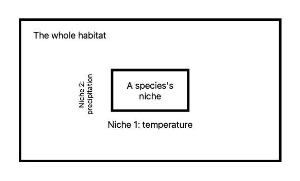

## Concept difference
- Habitat: where an organism lives is its habitat.
- Niche (not a place): a idea to describe how an organism lives within habitats.

Each habitat can provide many different niches where each species occupy. 

And each organism's niche is multi-dimensional. i.e., Each dimension represents a niche (e.g., temperature, precipitation).

Reference: 
Begon, Michael, and Colin R. Townsend. Ecology: from individuals to ecosystems. John Wiley & Sons, 2020.

## A 2D example

## A 3D full niche example
Below is a 3D figure (from MATLAB) to represent **FULL niche space** where environmental factors are axes, and optimal niche is the peak point (no predator's pressure, sufficient resources, mostly suitable climate). Values above zero mean that species can live in this environment.

But, this figure is nothing about habitat because  **niche and habitat don't necessarily match**. Some environment conditions does not exist in the world, or species are limited by dispersal ability. 

An important reason niche model has less predicting ability is this curve is not sure to keep same with time.

