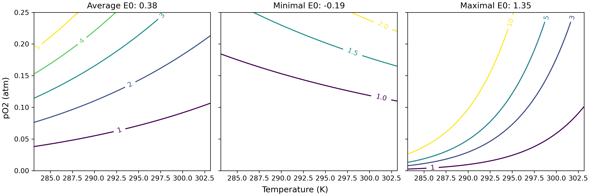

## Organism metabolism and oxygen

This post is to study the very cool metabolic index model (see the reference list). The metabolic index is a framework to quantify the environmental oxygen supply relative to the metabolic needs. The demand and supply of oxygen are both dependent on temperature (T) and biomass (B), while the supply of O2 has an extra constrain: the ambient pO2.

### Demand function

$$
f(T, B) = \alpha_D \cdot B^{\delta} \cdot \gamma(-E_d, T)
$$

where $\alpha_D$ is gas transfer rate per mass.

### Supply function

$$
f(T, B, \ce{pO2}) = \alpha_S \cdot B^{\sigma} \cdot \gamma(-E_s, T)\cdot \ce{pO2}
$$

where the function $\alpha_S$ represents the rate per unit of O2 pressure.

### Metabolic index

Divide the oxygen supply by demand gives the metabolic index.  
$$
\Phi = \frac{f(T,B,\ce{pO2})}{f(T, B)} = \frac{\alpha_S}{\alpha_D} \cdot B^{\delta - \sigma} \cdot \ce{pO2} \cdot \frac{\gamma{(-E_s,T)}}{\gamma{(-E_d,T)}}\\
$$

Temperature dependency $\gamma$ is an Arrhenius function:
$$
\gamma(-E, T) = exp((\frac{1}{T} - \frac{1}{T_{ref}}) \frac{-E}{k_B})\\
\frac{\gamma{(-E_s,T)}}{\gamma{(-E_d,T)}} = exp((\frac{1}{T} - \frac{1}{T_{ref}}) \frac{-(E_s - E_d)}{k_B})\\
$$
Note $k_B$ is the Boltzmann constant.  Set $E_0 = E_d - E_s; A_0 = \alpha_S/\alpha_D; n =\delta-\sigma$, then
$$
\Phi = A_0 \cdot B^n \cdot pO_2 \cdot \gamma(E_0, T)\\
$$
or
$$
\Phi = A_0 \cdot B^n \cdot pO_2 / \gamma(-E_0, T)\\
$$
## General intepretation of the metabolic index

First and formost, the metabolic index estimates the environmental carrying capacity (in terms of oxygen) of species sustainable metabolic rate relative to the minimum rate necessary for resting. It is related to both (1) the  ambient oxygen availability ($pO_2$) and (2) the metabolic demand which is related to biomass, temperature, and activity level.  Higher metabolic index indicates that the local environment can support higher metabolic rate, and therefore lower hypoxia risk. There are three levels of metabolic index: $\Phi=1$ (Resting state); critical $\Phi$ (minimal ecological activities, usually between 1.5 and 7 times the resting state for marine species); and maximal determined by the environment. The first scenario can be used to estimate model parameters based on lab experiments and surely the extirpation rate. The critical $\Phi$ is a useful tool to constrain the marine animal's biogeography. And the last one is more independent to species ecology when it comes to estimate the hypoxia risk (relative change of $\Phi$) across spatial and temporal gradient. For example, the $\Phi$ is lower in the tropics where enviromental oxygen supply is lower and the metabolic rate is higher. Vertically, it is more influenced by the oxygen minimum zones. In the future, it is projected to reduce, but is more attributed to the rising temperature compared to the loss of oxygen.

## Model parameters: metabolic and hypoxia traits

In the model parameters, there are metabolic traits ($E_d, E_s$ and derived $E_0$), hypoxia traits  ($\alpha_D, \alpha_S$ and derived $A_0$) and allometric traits ($\sigma, \delta$). These traits in turn determine the various demands of pO2 for different species under different metabolic levels.

To do the parameter estimation, we can solve the special cases: let $\Phi = 1$ and find the corresponding measurement of  temperature and pO2, metabolic rates in the experimental environment.

The allometric trait $n$ is the allometric scaling of the supply-to-demand ratio, which is typically near zero by fitting the critical oxygen~biomass model (Deutsch et al. 2015).

| Physiological trait        | Typical value  | Ecological meaning                         |
| -------------------------- | -------------- | ------------------------------------------ |
| $\alpha_S$                 |                | Supply efficiency                          |
| $\alpha_D$                 |                | Oxygen demand and therefore metabolic rate |
| $A_0 = \alpha_S/ \alpha_D$ |                |                                            |
| $V_h = \alpha_D/\alpha_S$  | 0-0.15         | Hypoxia risk                               |
| $E_S$                      | 0.29 ± 0.23 eV | Higher in the cool waters                  |
| $E_D$                      | 0.69 ± 0.36 eV |                                            |
| $E_0$ = $E_D - E_S$        | 0.40 ± 0.28 eV |                                            |
| *n* = δ − ε                | around 0       | Allometric influence                       |

## A summary and visualisation of the framework

Metabolic index is essentially a function of pO2 and temperature ($\Phi = f(pO2, T)$), which therefore can be visualised in contour plot. The physiological parameters describe the species difference in this function, and the $\Phi$ contour represents the different metabolic states.

It is consisent with theoretical prediction, let $\Phi$ equals 1, take log for both sides:
$$
ln(\ce{pO2}) = \frac{-E_0}{k_B}(\frac{1}{T} - \frac{1}{T_{ref}}) - ln(A_0)
$$
It is a linear model $ln(pO2) \sim 1/T$ with $-E_0$ as the slope and the $A_0$  the intercept. When E0 is positive as in the most species, the contour is showing the positive trend along temperature and oxygen gradient. It therefore suggests that the organism living in higher temperature have higher oxygen needs. It also shows that for the tropical species (the middle figure) have lower $\Phi$ compared to the high-latitude species. However, because of the lower $V_h$, they also have lower hypoxia risk.

Mapping the species occurrence data into this contour plot, then it is also possible to estimate the maximal $\Phi$ for different species, i.e., the maximal metabolic level that one species can reach.

## References

Deutsch, C. *et al.* Climate change tightens a metabolic constraint on marine habitats. *Science* (2015)

Deutsch, C. *et al.* Metabolic trait diversity shapes marine biogeography. *Nature* (2020)

Justin L. Penn et al. Temperature-dependent hypoxia explains biogeography and severity of end-Permian marine mass extinction. Science. 2018.

Penn, J. L. & Deutsch, C. Geographical and taxonomic patterns in aerobic traits of marine ectotherms. *Philosophical Transactions of the Royal Society B: Biological Sciences* **379**, 20220487 (2024).

Justin P. and Deutsch C. Avoiding ocean mass extinction from climate warming. *Science* (2022)

Deutsch, C. *et al.* Impact of warming on aquatic body sizes explained by metabolic scaling from microbes to macrofauna. *PNAS* (2022).

