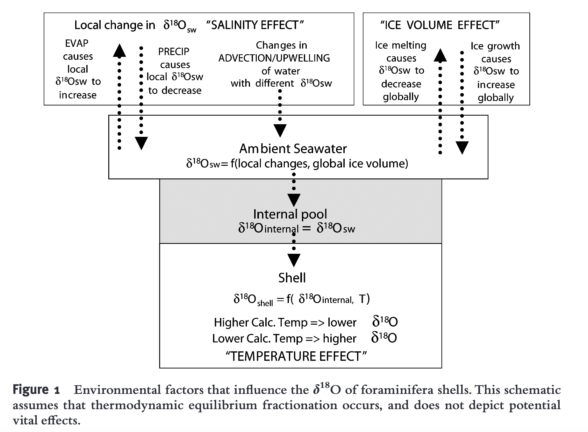

## Basics
Stable isotopes of oxygen are $^{16}O$, $^{18}O$ (an interesting one is the recently found $^{28}O$, but not sure its life time, Kondo et al. Nature 620, 965–970 (2023)). Isotopic fraction of oxygen isotopes happens when their relative abundance changes. Usually it can be decomposed into "ice volume effect" and "temperature effect" (Shackleton et al. 2023, https://doi.org/10.1038/s41561-023-01250-y).

> Figure 1 is from Ravelo and Hillaire-Marcel, 2007, Developments in Marine Geology, Volume 1

## Seawater $\delta^{18}O$

- Evaporation - Precipitation (both prefer light isotope) which influence salinity
- Ice volume effect (ice formation select light isotopes)
- Mixing

## Foraminifera test $\delta^{18}O$

Foraminifera incorporate oxygen when build calcite, therefore $\delta^{18}O$ in the calcite reflects the ambient environment with uncertainty $\epsilon$:
$$
\epsilon = \delta^{18}O_{cal} - \delta^{18}O_{sw}
$$
In general, higher temperature makes both atoms vibrates faster, and causing the relative difference between heave and light isotopes smaller. And vice versa, cooler environment has higher  $\delta^{18}O$ .  Generally, it forms a linear model

$$
T = a - b * \epsilon
$$

## Vital effects

- Symbionts
- Size
- carbonate ion concentration ([$\ce{CO3^2-}$]) probabily by influencing calcification rates and thus kinetic fractionation effects
- Species difference, particuarly their habitat depth

## References

Paul N. Pearson 2012, OXYGEN ISOTOPES IN FORAMINIFERA: OVERVIEW AND HISTORICAL REVIEW

Ana Christina Ravelo and Claude Hillaire-Marcel, 2007, The Use of Oxygen and Carbon Isotopes of Foraminifera in Paleoceanography
