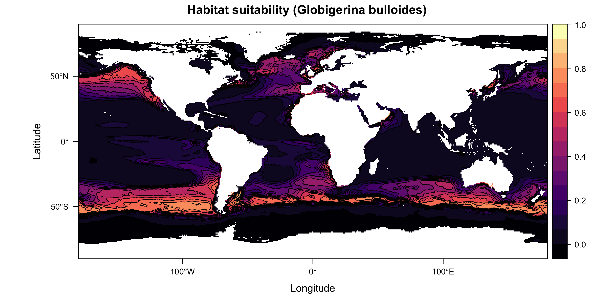

I am trying species distribution model recently and generating some nice figure, so I think my blog is a good place to store these pretty things.

## Platform
Most ecologists use R and there is a curated list of packages[^1-2].

## Main Steps
1. Presence-absence data & Environmental Data
2. Fit model (which could use different algorithms)
3. Project model to past/present/future environmental data

## More than data-model-projection
1. Variable selection: remove highly correlated and low-importance variable/feature
2. Data partition: split data into train data (to feed the model); validation data (for model tuning); test data (an independent examination dataset for the result of train+validation). Cross validation is to use different methods (randomly or spatially, or environmentally) to partition the data and fit/evaluate data.
3. Hyper-parameter of model: to tune a range of parameters in each specific model algorithm
4. Model evaluation: use AUC/TSS
4. Ensemble model: train models using different data partition strategies/model algorithms/hyperparameters and pick the best/mean output

## Planktic foraminifera case study

I use core-top data and convert them into presence/absence data. Then I model two species (G. ruber white/G. bulloides) using SST/SSS/NPP/Chl/phytoplankton biomass/ice cover/pH/. This is basically a just-for-fun version of  Waterson et al. (2017) reconstruction[^3]. Here is the results:

## References
[^1]. Sillero, N., Campos, J. C., Arenas-Castro, S., & Barbosa, A. M. (2023). A curated list of R packages for ecological niche modelling. Ecological Modelling, 476, 110242.
[^2]. https://github.com/helixcn/sdm_r_packages
[^3]. Waterson, A. M., Edgar, K. M., Schmidt, D. N. & Valdes, P. J. (2017). Quantifying the stability of planktic foraminiferal physical niches between the Holocene and Last Glacial Maximum: Niche Stability of Planktic Foraminifera. Paleoceanography 32, 74–89 

