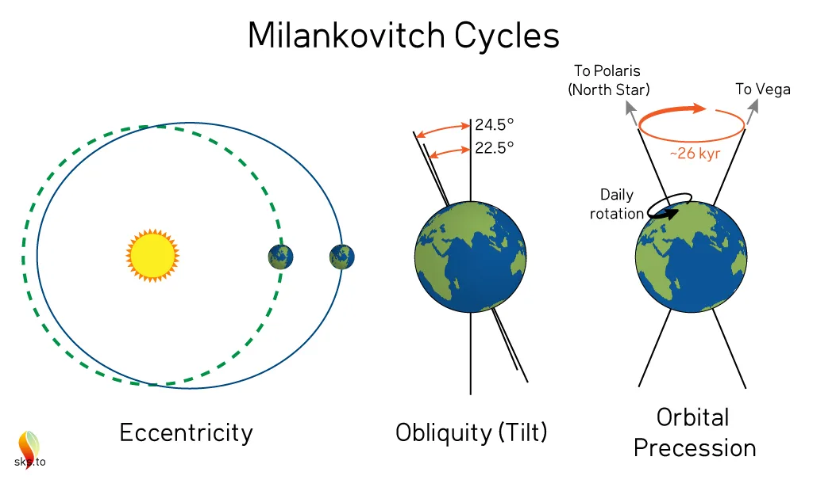
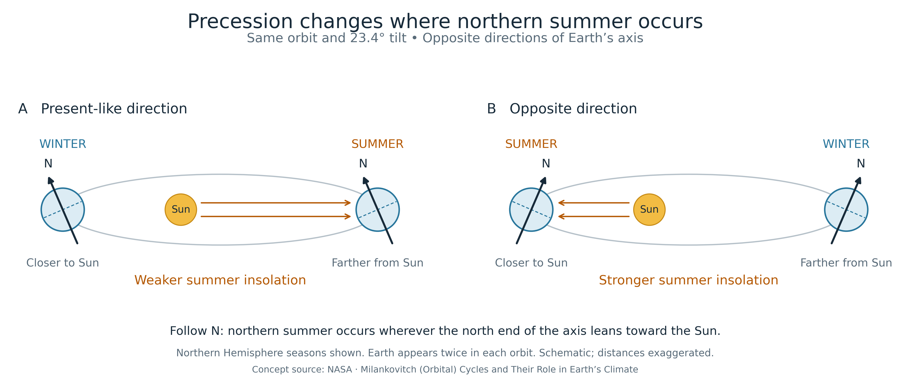

## 天文轨道参数
* Eccentricity：公转离心率, how elliptical Earth’s orbit is. 
* Obliquity：地轴不垂直于黄道面，这种倾斜（tilt）导致南北半球在一年中交替获得不同的光照，即季节性。
* Precession：Earth axis wobbles. 决定北半球夏天是远日点还是近日点

<!-- Fast Fourier Transform (time-frequency plot) is often used to decompose these three periodic drivers. -->

## 对于气候的影响

### Obliquity (Period: 41 ka)
Obliquity determines the latitudinal distribution of insolation. Greater obliquity increases summer insolation and strengthens seasonality at high latitudes. It also determines the latitudinal range of the subsolar point, including the northernmost latitude it reaches at the June solstice.

### Precession (Period: 23 ka)
Controls where the Norther summer is at: perihelion or aphelion.

Precession also influences Monsoon: warm summer -> strong land-sea temperature contrast -> more moisture movement

### Eccentricity (Period: 400/100 ka)
Regulate the how strongly precession affects summer sunlight

## 冰期-间冰期旋回

Milankovitch认为，轨道变化通过北纬夏季65度日照量影响冰盖积累、导致了冰期-间冰期的变化。这一理论被Shackleton et al. (1976, Science) 用d18O数据证实。

当然，这其中还涉及许多复杂的反馈机制，包括但不限于：

1. 冰盖反射阳光辐射，这是个正反馈调节; 海冰也将阻止海气交换和碳释放。
3. 洋流模式：AMOC的热和水汽输送无法有效到达极地、减少冰盖的形成。
2. Carbon-climate feedback: （a）增加$\ce{CO2}$在海水中的溶解度，导致深海碳储存上升；（b）温度减少有机碳分解，导致碳释放减少。温室气体的减少，加剧了降温。
4. 干旱导致的粉尘和铁元素输送、增加海洋生物泵效率
5. 风力强度影响上升流和生物生产力

这些机制反映了各种气候系统之间的复杂交互作用， 最常研究的包括水循环和碳循环，分别以$\delta^{18}$O和$\delta^{13}$C指示。接下来的新生代气候演化研究就主要基于这两个proxy的数据。

### References
https://science.nasa.gov/science-research/earth-science/milankovitch-orbital-cycles-and-their-role-in-earths-climate/

Zachos, J., Pagani, M., Sloan, L., Thomas, E. & Billups, K. Trends, Rhythms, and Aberrations in Global Climate 65 Ma to Present. Science 292, 686–693 (2001).

Westerhold, T. et al. An astronomically dated record of Earth’s climate and its predictability over the last 66 million years. Science 369, 1383–1387 (2020).

The Cenozoic CO2 Proxy Integration Project (CenCO2PIP) Consortium,Toward a Cenozoic history of atmospheric CO2. Science, eadi5177 (2023)

徐建，刘臖，陈漪馨，孙金梁, 2020, 浅述低纬过程在全球气候变化中的重要性, 第四纪研究, 40 (3):595-604

http://blog.sciencenet.cn/u/Brother8

https://www.metoffice.gov.uk/weather/climate/climate-explained/what-is-climate
