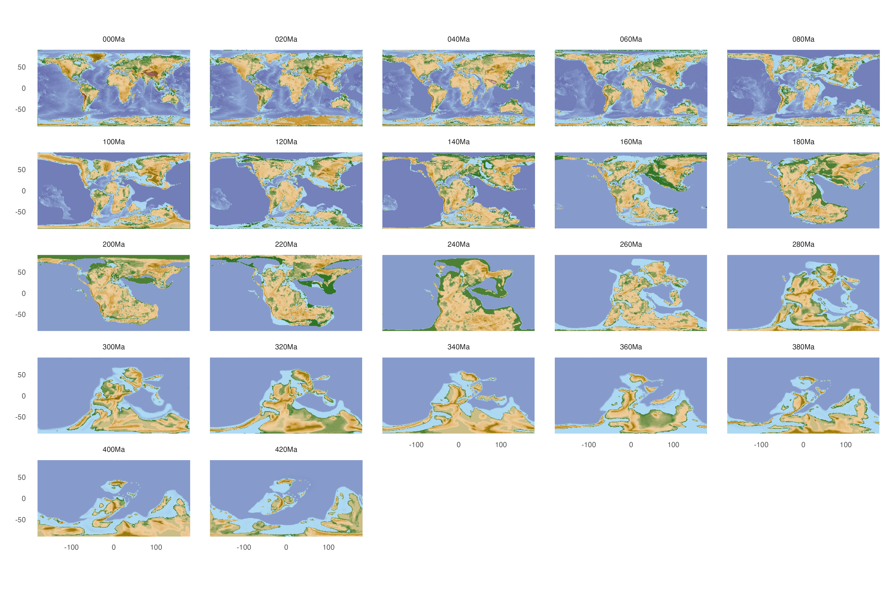

## Motivation
Two years ago, I wrote a post about [plotting maps in R](https://www.ruiying.online/2021-11-19-cartography-in-r/). Recently, I wanted to understand more about the paleogeography evolution (e.g., Pohl et al. 2022 Nature) and its corresponding geological time, so I explored the available resources on the Internet.

## Data
AFAIK, there are two main sources of paleogeography data: [PALEOMAP](https://www.earthbyte.org/paleomap-paleoatlas-for-gplates/) by [Christopher Scotese](http://www.scotese.com/) and [GPlates](https://www.gplates.org/) by [EarthByte group](https://www.earthbyte.org). The PBDB database possibly also contains some portals to explore this, but it is essentially a fossil database.

There are also different types of paleogeography data: coastlines, polygons, digital elevation model (DEM), tectonic plates etc.

## Softwares and packages
Then, there are many packages in R/Python to access these data (mostly the GWS service of Gplates). Ben Moon has written some posts on this, check it [here](https://bcmoon.uk/palaeontology/palaeomaps-in-R/).
Below is a list of softwares/packages I reviewed:


| Software   |      Description      |  URL |
|----------|:-------------:|------:|
| Gplates| A standalone plate reconstruction software (No programming) | https://www.gplates.org/ |
| pyGplates| A python interface to Gplates | https://www.gplates.org/docs/pygplates/ |
| gplately| A high-level interface to pyGPlates |https://github.com/GPlates/gplately|
| rgplates | Gplates R API| https://github.com/adamkocsis/rgplates |
| paleoMap |    A R package, not "the PLAEOMAP"   |   https://github.com/sonjaleo/paleoMap |
| gplatesr | Another R package using Gplates API |    https://github.com/LunaSare/gplatesr |
| mapast  | Another R package using Gplates API |    https://github.com/macroecology/mapast|
| velociraptr | R package using macrostrat API |    https://github.com/LunaSare/gplatesr |
| chronosphere | A R package collecting lots of data in Zenodo beyond paleogeography |    https://github.com/chronosphere-info/r_client|
| via | A dataset (paleocoastlines) is provided to describe coastlines of 0, 10, 20 Ma  |  https://cran.r-project.org/web/packages/via/index.html|
| cgeniepy | My Python Package  using Gplates' API |  https://doi.org/10.21105/joss.06762 |

What if someone just wants to use a fancy map for demonstration? I think it is easist to use the exisitng [PALEOMAP Atlas](https://www.earthbyte.org/paleomap-paleoatlas-for-gplates/). Download the data and use the pictures directly (or put into Gplates for a different projection and export in different format), here is an example of the modern global map.


## Plotting the paleogeography evolution in the whole Phanerozoic

Making a pretty paleogeography map from scratch requires a bunch of data (and proper tool and knowledge). I have tried several ways but still can't reproduce a full-feature map as the PaleoAtlas because of lacking data. For instance, in `Gplately`, many features in Scotese2016 are missing (only has static polygons, coastlines, and rotation file). Nevertheless, below is some codes for plotting paleocontinent/paleoDEM.

### Tectonic plates
Here I use `velociraptr` to reconstruct the Pohl2022 like map series, it starts from 540 Ma and ends in the present with a time gap of 20 Myr. This package downloads paleocontinents from Macrostrat.org as a shapefile.

```r
library(velociraptr)

age_to_plot <- seq(0, 540, 20)

## download data and save into a list
paleo_data <- lapply(age_to_plot, downloadPaleogeography)

## add age to each data
paleo_data <- lapply(1:length(paleo_data), function(x) {
  paleo_data[[x]]$age <- paste(age_to_plot[x], "Ma")
  return(paleo_data[[x]])
})

## combine all data into one data frame
paleo_data <- do.call(rbind, paleo_data)
paleo_data$age <- forcats::fct_reorder(paleo_data$age,
                                       readr::parse_number(paleo_data$age))

## plot in Robin projection
library(ggplot2)
p <- ggplot(paleo_data)+
  geom_sf(aes(fill=plate_id))+
  coord_sf(crs = "+proj=robin")+
  facet_wrap(~age, ncol=5) +
  theme_minimal()+
  theme(panel.grid = element_line(color = "black", linewidth = .2),
        strip.text = element_text(size=12, face="bold"),
        legend.position = "none")

p + scale_fill_viridis_c() + theme(legend.position='none')
```


### Topography (PaleoDEM)
Here I plot the topography using PaleoDEM data. Note there're many data formats and here I use .csv.

```R
library(data.table)
library(stringr)
library(marmap)

## list all files
## data is downloaded from https://zenodo.org/records/5460860
## NetCDF is also available
folder <- "~/Downloads/PaleoDEMS_long_lat_elev_csv_v2/PaleoDEMS_long_lat_elev_csv_v2.csv/"
data_files <- list.files(folder, full.names = T)[seq(1, 88, 4)]

## read in data and add age column
paleo_dem <- lapply(data_files, fread)

## add age info
paleo_dem <- lapply(1:length(paleo_dem), function(x) {
  filename <- list.files(folder, full.names = F)[seq(1, 88, 4)][x]
  ## parse age from filename
  age <- str_extract(filename, "\\d+Ma")
  paleo_dem[[x]]$age <- age
  return(paleo_dem[[x]])
})
paleo_dem<- do.call(rbind,paleo_dem)

p <- ggplot(paleo_dem) +
  geom_raster(aes(x = `# lon`, y = lat, fill = elev))+
  coord_fixed()+
  facet_wrap(~age)

p + scale_fill_etopo()+theme_minimal()+
  theme(panel.grid = element_blank(),
        legend.position='none')+
  labs(x='',y='')
```


### cgeniepy

```python
from cgeniepy.table import ScatterData
import pandas as pd
import numpy as np

# Generate random data
np.random.seed(1239124)  # Set seed for reproducibility

# Create random latitude, longitude, and variable values
random_data = pd.DataFrame({
    'lat': np.random.uniform(-90, 90, 100),
    'lon': np.random.uniform(-180, 180, 100),
    'dummy_var': np.random.random(100) * 100
})

# Convert to ScatterData object
random_data = ScatterData(random_data)

# Set MultiIndex for the data
random_data.set_index(['lat', 'lon'])

# Plot with specified parameters
random_data.plot(var='dummy_var', edgecolor='k', mask_age=100)
```


## References

Pohl, Alexandre, et al. "Continental configuration controls ocean oxygenation during the Phanerozoic." Nature 608.7923 (2022): 523-527.

Cermeño, Pedro, et al. "Post-extinction recovery of the Phanerozoic oceans and biodiversity hotspots." Nature 607.7919 (2022): 507-511.
