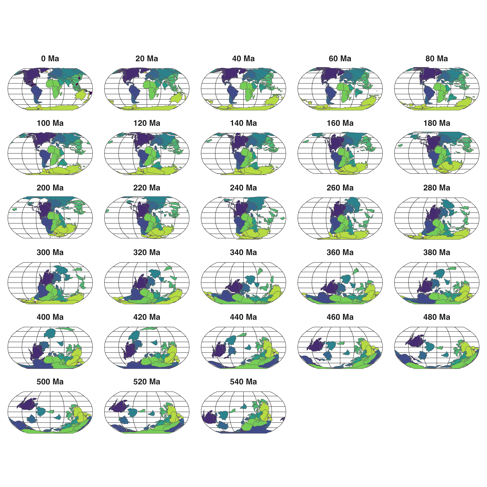

## Motivation
Two years ago, I wrote a post about [plotting maps in R](https://www.ruiying.online/2021-11-19-cartography-in-r/). Recently, I wanted to understand more about the paleogeography evolution (e.g., Pohl et al. 2022 Nature) and its corresponding geological time, so I explored the available resources on the Internet.

## Data
AFAIK, there are two main sources of paleogeography data: [PALEOMAP](https://www.earthbyte.org/paleomap-paleoatlas-for-gplates/) by [Christopher Scotese](http://www.scotese.com/) and [GPlates](https://www.gplates.org/) by [EarthByte group](https://www.earthbyte.org). The PBDB database possibly also contains some portals to explore this, although it is essentially a fossil database.

There are also different types of paleogeography data: coastlines, polygons, digital elevation model (DEM), tectonic plates etc.

## Softwares and packages
Then, there are many packages in R/Python to access these data (mostly the GWS service of Gplates). Ben Moon has written some posts on this, check it [here](https://bcmoon.uk/palaeontology/palaeomaps-in-R/).
Below is a list of softwares/packages I found:


| Software   |      Description      |  URL |
|----------|:-------------:|------:|
| Gplates| A standalone plate reconstruction software | https://www.gplates.org/ |
| gplately| Official Gplates Python API |https://github.com/GPlates/gplately|
| rgplates | Gplates R API| https://github.com/adamkocsis/rgplates |
| paleoMap |    A R package, not "the PLAEOMAP"   |   https://github.com/sonjaleo/paleoMap |
| gplatesr | Another R package using Gplates API |    https://github.com/LunaSare/gplatesr |
| mapast  | Another R package using Gplates API |    https://github.com/macroecology/mapast|
| velociraptr | R package using macrostrat API |    https://github.com/LunaSare/gplatesr |
| chronosphere | A R package collecting lots of data in Zenodo beyond paleogeography |    https://github.com/chronosphere-info/r_client|

What if someone just wants to use a fancy map for demonstration? I think it is easist to use the exisitng [PALEOMAP Atlas](https://www.earthbyte.org/paleomap-paleoatlas-for-gplates/). Download the data and use the existing pages directly, here is an example of the Cretaceous-Paleogene Boundry (66 Ma):


## Phanerozoic paleogeography evolution
Next I use `velociraptr` to reconstruct the Pohl2022 like map series, it starts from 540 Ma and ends in the present with a time gap of 20 Myr. The code is as follows:

```r
library(velociraptr)

age_to_plot <- seq(0, 540, 20)

## download data and save into a list
paleo_data <- lapply(age_to_plot, downloadPaleogeography)

## add age to each data
paleo_data <- lapply(1:length(paleo_data), function(x) {
  paleo_data[[x]]$age <- paste(age_to_plot[x], "Ma")
  return(paleo_data[[x]])
})

## combine all data into one data frame
paleo_data <- do.call(rbind, paleo_data)
paleo_data$age <- forcats::fct_reorder(paleo_data$age,
                                       readr::parse_number(paleo_data$age))

## plot in Robin projection
library(ggplot2)
p <- ggplot(paleo_data)+
  geom_sf(aes(fill=plate_id))+
  coord_sf(crs = "+proj=robin")+
  facet_wrap(~age, ncol=5) +
  theme_minimal()+
  theme(panel.grid = element_line(color = "black", linewidth = .2),
        strip.text = element_text(size=12, face="bold"),
        legend.position = "none")

p + scale_fill_viridis_c() + theme(legend.position='none')
```


## References
Pohl, Alexandre, et al. "Continental configuration controls ocean oxygenation during the Phanerozoic." Nature 608.7923 (2022): 523-527.
