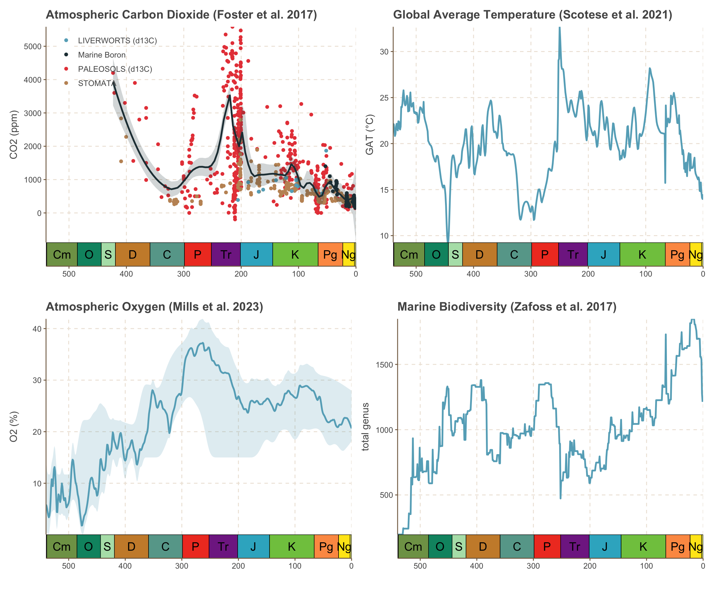

## Climate, landscape, and biodiversity
Besides the change of [paleogeography](https://www.ruiying.online/2023-12-30-a-series-of-paleogeography-maps/), the Phanerozoic climate has experienced remarkable changes. Based on the modelled global average temperature (because most oxygen isotopic data are in the tropics), the Earth has alternated between the "icehouse" and "warmhouse" states (so called "Double Hump"). The early Paleozoic and the whole Mesozoic have warmer climate, while the late paleozoic and Cenzoic represent the "cool Earth". Such evolution of climate has been related to the formation and breakup of super-continent, Pangaea, which happened in around 300 and 200 Ma respectively. Others also suggest the impact of Large Igneous Provinces (LIPS) (warming) and bolide impacts (cooling). Of the most studied are the Siberian Traps and Deccan Traps associated with the end-Permian and the end-Cretaceous extinction event. The other exceptional transitions include the late Ordovician cooling which is supposed to cause the first massive extinction.

The atmospheric composition in the early Phanerozoic also experienced great changes, mainly the CO<sub>2</sub> and O<sub>2</sub>. Obviously they played an important role in the climate change because one of them is the greenhouse gas, and the other closely links to the biosphere and methane (the other greenhouse gas with stronger warming effects than CO<sub>2</sub>). The driver of the atmospheric composition has been another compelling story that I do not want to dive deeper here. 

The rising oxygen level in the Early and Middle Paleozoic clearly links to the rising biodiversity. The diversification of gastropod and bivalve happened in the Ordovician shallow-water environment, and more vertebrates including many fish evolved in the Devonian. The next is the end-Permian extinction corresponding to the declining oxygen and spiking CO<sub>2</sub>. Finally when the oxygen stablise in the Late Triassaic, more mammal are found. And after the K-Pg boundary that kills the dominant "reptiles" in the Mesozoic, our ancestor become the king of this planet.

However, a very latest study (Salles et al. 2023) suggests that the evolution of plate tectonics change the sediment flux through weathering and nutrient discharge. Clearly nutrient determines the carrying capacity of environment, and thus the biodiversity. What is the relationship among climate, landscape, and biodiversity? How do they interact with each other? These questions need probably several generations to answer.

## Origination and extinction of biodiversity
Biodiversity can be regarded in ecological modes (e.g., mobility, feeding strategies) and taxonomic richness (number of genus). The diversification of both is a net result of origination and extinction. Knope et al. (2020) studied the origination and extinction rate of ecological and taxonomic diversity. They found that the origination and extinction rate tended to increase with taxonomic richness before Cenozoic, while the origination and extinction rate mostly decreased with ecological diversity. This means that although the taxonomic richness was high in the early ages, the extinction and turnover rate is also remarkable. This prevails until the accumulation of ecological modes (mostly the complex physiological system and mobile ability),which make organism to be more resilient in extinction event. By such, the coupling strength between ecological and taxonomic diversity grows through time. In my interpretation, ecological modes are the "true and useful" diversification and will saturate, while the genus number is the appearance in this production process.


```R
library(tidyverse)
library(deeptime)
library(ggthemr)

ggthemr('fresh')

## Global Average Temperature
scotese2021 <- read_csv("https://raw.githubusercontent.com/ruiying-ocean/phanerozoic_data/main/phanerozoic_data/Scotese2021.csv")

## CO2
foster2017 <- read_csv('https://raw.githubusercontent.com/ruiying-ocean/phanerozoic_data/main/phanerozoic_data/Foster2017.csv')

##  O2 (GEOCARBSULF/COPSE)
mills2023 <- read_csv('https://raw.githubusercontent.com/ruiying-ocean/phanerozoic_data/main/phanerozoic_data/Mills_etal_2023_AREPS_O2.csv')
mills2023$Time <- mills2023$Time * -1

## biodiversity
zafoss2017 <- read_csv("https://raw.githubusercontent.com/ruiying-ocean/phanerozoic_data/main/phanerozoic_data/ContinuousTimeSeries.csv")

p1 <- ggplot(foster2017, aes(x = Age, y = CO2)) +
  geom_point(aes(color=Proxy))+
  geom_smooth(method = "loess", span = 0.1, alpha = 0.2,
              level=0.95, linewidth=1) +
  coord_geo()+
  theme(legend.position = c(0.2,0.85),
        legend.title = element_blank(),
        legend.background = element_blank())+
  ggtitle('Atmospheric Carbon Dioxide (Foster et al. 2017)')+
  xlim(540,0)+
  labs(x='', y='CO2 (ppm)')+
  ## two rows of legend
  guides(color = guide_legend(nrow = 4))

p2 <-scotese2021 %>%  ggplot(aes(x = Age, y = GAT)) +
  geom_line(linewidth=1)+
  coord_geo()+
  ggtitle('Global Average Temperature (Scotese et al. 2021)')+
  xlim(540,0)+
  labs(x='', y='GAT (°C)')

p3 <- mills2023 %>% ggplot() +
  geom_line(aes(x = Time, y = Mid),linewidth=1)+
  geom_ribbon(aes(x = Time, ymin = Min, ymax = Max), alpha = 0.2)+
  coord_geo()+
  ggtitle('Atmospheric Oxygen (Mills et al. 2023)')+
  xlim(540,0)+
  labs(x='', y = 'O2 (%)')

p4 <- zafoss2017 %>% 
  ggplot(aes(x = Age, y = `genus range-through`)) +
  geom_line(linewidth=1)+
  coord_geo()+
  ggtitle('Marine Biodiversity (Zafoss et al. 2017)')+
  xlim(540,0)+
  labs(x='', y='total genus')

library(patchwork)
p.left <- p1+p2
p.right <- p3+p4
p.left / p.right
```



## Bibliography
1. Zaffos, A., Finnegan, S. & Peters, S. E. Plate tectonic regulation of global marine animal diversity. Proc. Natl. Acad. Sci. 114, 5653–5658 (2017).
2. Mills, B. J. W., Krause, A. J., Jarvis, I. & Cramer, B. D. Evolution of atmospheric O2 through the phanerozoic, revisited. Annu. Rev. Earth Planet. Sci. 51, 253–276 (2023).
3. Foster, G. L., Royer, D. L. & Lunt, D. J. Future climate forcing potentially without precedent in the last 420 million years. Nat. Commun. 8, 14845 (2017).
4. Scotese, C. R., Song, H., Mills, B. J. W. & Van Der Meer, D. G. Phanerozoic paleotemperatures: the earth’s changing climate during the last 540 million years. Earth Sci. Rev. 215, 103503 (2021).
5. https://earthstep.wordpress.com/tag/evolution-of-atmosphere/
6. Alcott, L. J., Mills, B. J. W. & Poulton, S. W. Stepwise earth oxygenation is an inherent property of global biogeochemical cycling. Science 366, 1333–1337 (2019).
7. https://zhuanlan.zhihu.com/p/68549205
8. https://zh.wikipedia.org/zh-hans/%E7%94%9F%E5%91%BD%E5%8F%B2
9. Knope, M. L., Bush, A. M., Frishkoff, L. O., Heim, N. A. & Payne, J. L. Ecologically diverse clades dominate the oceans via extinction resistance. Science 367, 1035–1038 (2020).
10. Salles, T., Husson, L., Lorcery, M. & Hadler Boggiani, B. Landscape dynamics and the phanerozoic diversification of the biosphere. Nature 624, 115–121 (2023).

