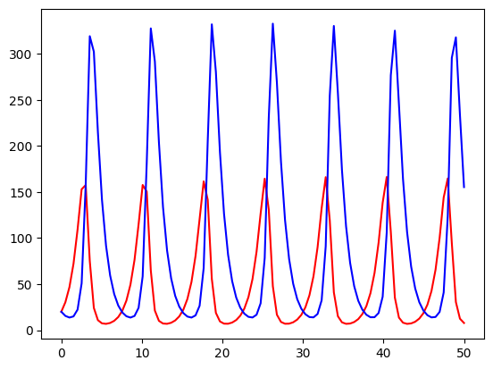

``` python
import numpy as np
from scipy.integrate import odeint

def derivative(X, t, alpha, beta):
    """
    derivative of X at time t with given parameters
    """
    x, y=X
    dxdt = x * (1 - alpha*y)
    dydt = -y * (1 - beta*x)
    return [dxdt, dydt]

# set time, init conditon and parameter values
t = np.linspace(0, 50, 100)
X0 = [20, 20]
alpha = 0.01
beta = 0.02

## solve ode
sol = odeint(derivative, X0, t, args=(alpha, beta))

## plot
import matplotlib.pyplot as plt
plt.plot(t, sol[:, 0], 'r', label='x')
plt.plot(t, sol[:, 1], 'b', label='y')
```


