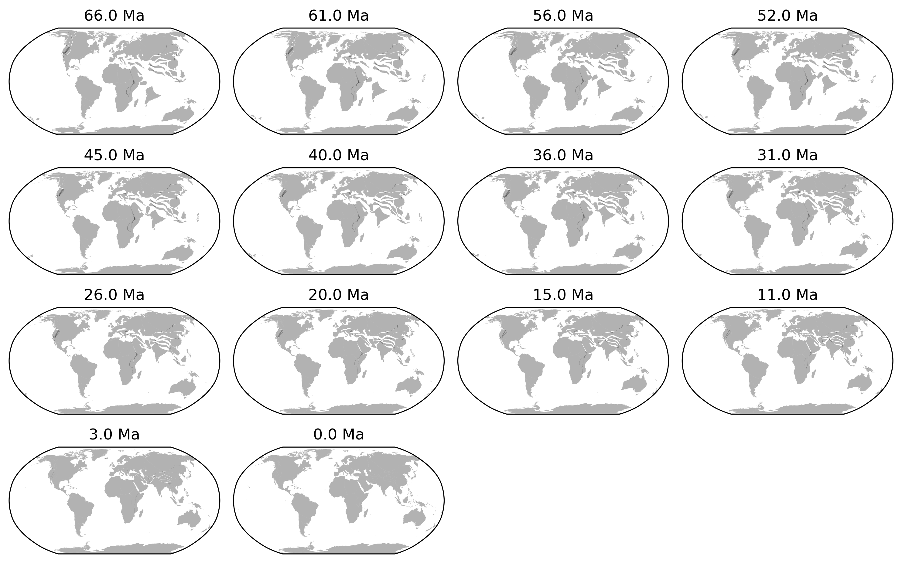

<!--more-->
## Cenozoic climate evolution

> What is climate? Climate is the general weather over a long period (> 30 years). This can include temperature, humidity, pressure, wind, precipitation, and any other weather condition. In a broader term, it includes the state of several components: including the atmosphere, hydrosphere, cryosphere, lithosphere and biosphere.


Cenozoic climate is characterised by it cooling trend. Westerhold et al. 2020 divided it into 

1. hothouse
2. warmhouse
3. coolhouse
4. icehouse

Before icehouse, obliquity-related cycles are sparse (the lack of high-latitude ice sheet) and the eccentricity-related cycles dominate, indicating a strong influence of low-latitude processes (heat and moisture transport) on climate variations. Before icehouse, the climate  is more deterministic, particularly in the $\delta^{18}$O compared to $\delta^{13}$C, likely because of less nonlinear feedback related to ice sheet.

### Paleocene (66-56 Ma)
Paleocene is charaterised by the highest carbon isotope values in the whole Cenozoic. The transition between Paleocene and Eocene is the PETM event famous for its geologically rapid and extreme warming.

### Eocene (56-34 Ma)
Following the PETM, Eocene (particularly early Eocene) is a generally warm period with flat pole-to-equator thermal gradient.

### Oligocene (34-23 Ma)
since the EOT, antarctic ice sheet gradually appeared. The opening of drake passage (~33 Ma) allows the appearance of ACC that blocks the heat transport; The Antarctic glaciation also initialised Antarctic Bottom Water (AABW) due to brine injection.

### Miocene (23-5.3 Ma)
> [Steinthorsdottir et al. 2020](https://agupubs.onlinelibrary.wiley.com/doi/full/10.1029/2020PA004037) has a complete review of Miocene climate.

* Middle Miocene Climatic Optimum (MMCO): another relatively warm period before the cooling of MMCT.
* Middle Miocene Climatic Transition (MMCT, 14.7–13.8 Ma): abrupt cooling, growth of the East Antarctic Ice Sheet

### Pliocene (5.3-2.6 Ma)
> [McClymont et al. 2023](https://agupubs.onlinelibrary.wiley.com/doi/full/10.1029/2022RG000793) has a good review on INHG.
* The closure of the Central American Seaway (2.95–2.82 Ma) contributes to the moisture for the Northern Hemisphere Glaciation (2.6-2.7Ma)

### Pleistocene (2.6 Ma-0.01 Ma)
> See [Herbert 2003, The Mid-Pleistocene Climate Transition](https://www.annualreviews.org/content/journals/10.1146/annurev-earth-032320-104209)
* Intensification of Northern Hemisphere Glaciation (INHG, 2.6-2.7 Ma). NH differs from SH in its greater cover of land than ocean. This means that the NHG can accelerate the cooling of climate.

* Mid Pleistocene Transition (MPT, 1.2–0.7 Ma): climatic cycle changes rhythm from 41-kyr to 100 kyr-dominated.

## Evolution of paleogeography


```python3
import os, glob

import cartopy.crs as ccrs
import gplately
from gplately import pygplates
import matplotlib.pyplot as plt
from plate_model_manager import PlateModelManager


# Directory to plate model files
input_directory = "/Users/yingrui/Science/PaleoMapAtlas/Scotese PaleoAtlas_v3/PALEOMAP PaleoAtlas Rasters v3/Map1a PALEOMAP PaleoAtlas.gpml"

# Locate topology feature files and set up a FeatureCollection object 
topology_filenames = glob.glob(os.path.join(input_directory, '*.gpml'))
topology_features = pygplates.FeatureCollection()
for topology_filename in topology_filenames:
    # (omit files with the string "inactive" in the filepath)
    if "Inactive" not in topology_filename:
        topology_features.add( pygplates.FeatureCollection(topology_filename) )
    else:
        topology_filenames.remove(topology_filename)

pm_manager = PlateModelManager()
scotese_model = pm_manager.get_model("Scotese2016", data_dir="plate-model-repo")

rotation_model = scotese_model.get_rotation_model()
static_polygons = scotese_model.get_static_polygons()
coastlines = scotese_model.get_layer('Coastlines')

model = gplately.PlateReconstruction(rotation_model, topology_features, static_polygons)

## plot 66 Ma to 0 Ma
gplots = []
time_slices = [66, 61, 56, 52, 45,40,36,31,26,20,15,11,3,0]
for time in time_slices:
    gplots.append(gplately.PlotTopologies(
    model,
    coastlines=coastlines,
    continents=None,
    COBs=None,
    time=time,
    anchor_plate_id=0, # by default the anchor plate is set to zero
))
    
## 14 subplots
fig, axs = plt.subplots(4, 4, figsize=(10, 10), subplot_kw={'projection': ccrs.Robinson()}, tight_layout=True)

for i, gplot in enumerate(gplots):
    ax = axs[i//4, i%4]
    gplot.plot_coastlines(ax, color='k',alpha=0.3,facecolor='1')
    ax.set_global()
    ## add time as title
    ax.set_title(f"{gplot.time} Ma")

## remove empty subplots
for i in range(len(time_slices), 16):
    axs[i//4, i%4].axis('off')

## save figure
plt.savefig("Scotese2016_PaleoAtlas.png", dpi=300, bbox_inches='tight')
```
