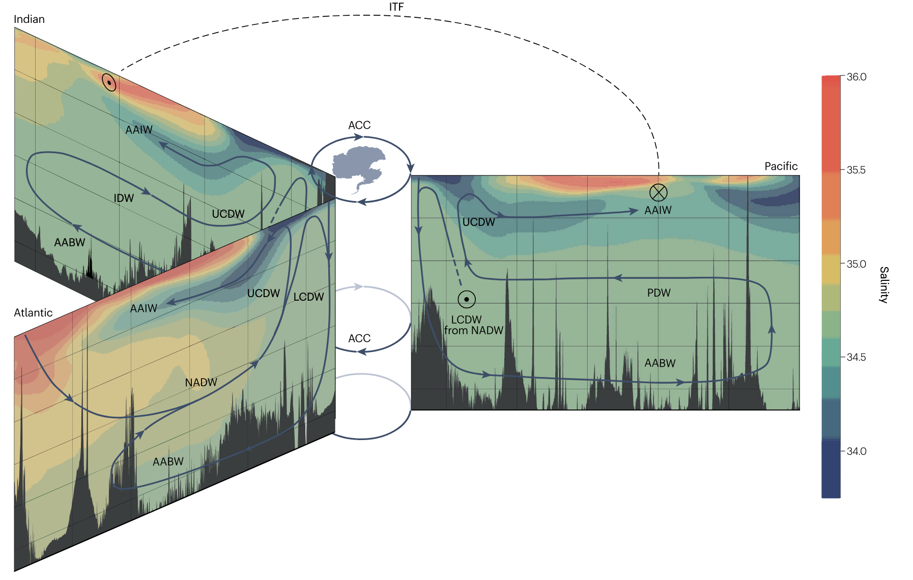

<!--more-->

The global ocean circulation, often referred to as the thermohaline circulation, is driven by density differences caused by variations in temperature and salinity. This post studies the important water masses.

## South Source Water

Antarctic is the centre of ocean world, so let's start with south source water. 

### Antarctic Bottom Water (AABW)

AABW is formed at Antarctic shelves, particularly in the Weddell Sea and Ross Sea. It is the densest water mass in the global ocean and spreads northward along the ocean floor.

### Circumpolar Deep Water (CDW)

CDW is a mixture of waters from the Atlantic, Pacific, and Indian Oceans. It can be divided into:

- **Upper Circumpolar Deep Water (UCDW)**: Upwelling CDW that rises toward the surface in the Southern Ocean
- **Lower Circumpolar Deep Water (LCDW)**: Continues to sink and contributes to deep ocean ventilation

### Pacific Deep Water (PDW)

PDW flows from the Pacific into the Southern Ocean, where it mixes with other water masses.

### Antarctic Intermediate Water (AAIW)

AAIW forms at the Antarctic Polar Front and spreads northward at intermediate depths (around 500-1000 m) into all three major ocean basins.

## North Source Water

The North Atlantic is a key region for deep water formation and usually discussed with Atlantic Meridional Ocean Circulation (AMOC).

### Upper North Atlantic Deep Water (UNADW)

UNADW is formed in the Labrador Sea through deep convection during winter cooling.

### Lower North Atlantic Deep Water (LNADW)

LNADW originates from the Nordic Seas and Arctic Basin. It is denser than UNADW and occupies deeper levels in the water column.

## Pacific Deep Water

Modern Pacific deep water primarily originates from the Southern Ocean rather than local formation. This is because:

1. The Pacific lacks significant deep water formation sites comparable to the North Atlantic
2. AABW and modified CDW flow northward into the Pacific basin
3. These southern-sourced waters gradually age and accumulate nutrients as they travel through the Pacific

