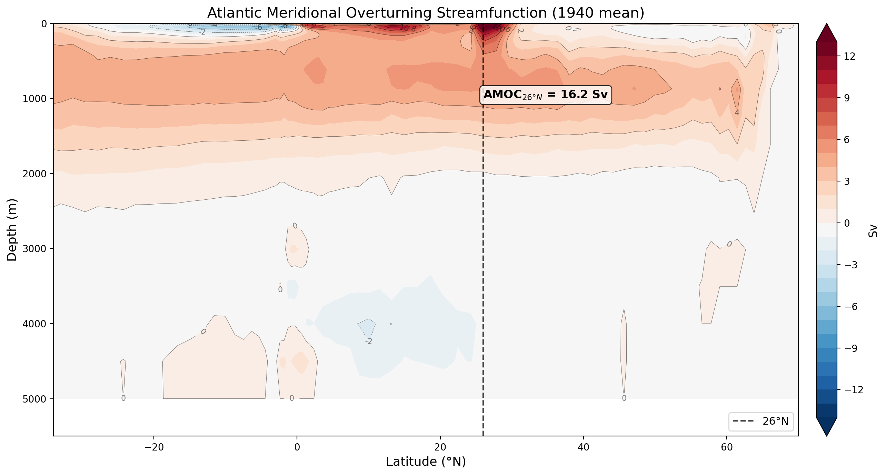

The Atlantic Meridional Overturning Circulation (AMOC) is one of the key diagnostics for ocean models. [CDFTOOLS](https://github.com/meom-group/CDFTOOLS) is a suite of Fortran utilities for analysing NEMO output on its native grid. This post walks through compiling CDFTOOLS, using `cdfmoc` to compute the MOC streamfunction, and plotting the results in Python.

## 1. Compiling CDFTOOLS

CDFTOOLS requires a Fortran compiler and the NetCDF-Fortran library.

### Prerequisites

Make sure NetCDF is available. On an HPC system this is typically done via modules:

```bash
module load netcdf/4.7.4/gcc
```

You can verify the installation with:

```bash
nf-config --fflags
nf-config --flibs
```

### Build

Clone and compile:

```bash
cd $HOME/src
git clone https://github.com/meom-group/CDFTOOLS.git
cd CDFTOOLS
```

Copy and edit the appropriate `makefile` for your system. The key variables to set are `FC` (Fortran compiler), `FFLAGS`, and the NetCDF paths:

```bash
cp Makefile.macro Makefile.macro.local
```

Edit `Makefile.macro.local` to match your environment, e.g. for gfortran:

```makefile
FC      = gfortran
FFLAGS  = -O2 -fPIC $(shell nf-config --fflags)
LDFLAGS = $(shell nf-config --flibs)
```

Then build:

```bash
make -f Makefile.macro.local
```

The binaries are placed in `bin/`. Verify the build:

```bash
./bin/cdfmoc --help
```

## 2. Using `cdfmoc`

`cdfmoc` computes the Meridional Overturning Circulation streamfunction from NEMO's grid_V (meridional velocity) output. It integrates meridional velocity zonally and vertically to produce the overturning streamfunction in Sverdrups (Sv, 1 Sv = 10⁶ m³/s).

### Required inputs

- **grid_V file** — NEMO meridional velocity output (e.g. `ORCA2_1m_20000101_20001231_grid_V.nc`)
- **Mask files** — NEMO mesh/mask files. `cdfmoc` expects these filenames in the working directory:
  - `mesh_hgr.nc` — horizontal mesh
  - `mesh_zgr.nc` — vertical mesh
  - `mask.nc` — land/sea mask
  - `new_maskglo.nc` — basin mask (Atlantic, Pacific, Indian, etc.)

If your mesh and mask are combined (e.g. `mesh_mask.nc`), you can symlink them:

```bash
ln -sf mesh_mask.nc mesh_hgr.nc
ln -sf mesh_mask.nc mesh_zgr.nc
ln -sf mesh_mask.nc mask.nc
```

### Running cdfmoc

Basic usage with just the grid_V file, remember to load the netcdf library if start from a fresh session:

```bash
cdfmoc -v grid_V.nc
```

If you also want density-based decomposition, pass the grid_T file:

```bash
cdfmoc -v grid_V.nc -t grid_T.nc
```

This produces `moc.nc` containing the streamfunction variables:
- `zomsfglo` — Global MOC
- `zomsfatl` — Atlantic MOC (this is the AMOC)
- `zomsfpac` — Pacific MOC
- `zomsfinp` — Indo-Pacific MOC

## 3. Plotting the Results

The output `moc.nc` can be read and plotted with Python using xarray and matplotlib.

### Reading the MOC file

```python
import xarray as xr
import numpy as np

ds = xr.open_dataset("MOC/moc_2000.nc", decode_times=False)
print(ds.data_vars)  # zomsfatl, zomsfglo, ...
```

### Extracting AMOC strength at 26.5N

The AMOC strength is conventionally measured as the maximum of the Atlantic streamfunction over depth at 26.5°N — the latitude of the RAPID mooring array. In ORCA2, this corresponds approximately to y-index 94:

```python
moc_atl = ds["zomsfatl"]

# Select 26.5N (y-index 94 in ORCA2), take max over depth
amoc_26n = moc_atl.isel(y=94).max(dim="depthw")

# Annual mean
amoc_value = float(amoc_26n.mean(dim="time_counter").values)
print(f"AMOC at 26.5N: {amoc_value:.1f} Sv")
```

The observed AMOC strength from the RAPID array is approximately 17 Sv.

### Plotting the streamfunction

```python
import matplotlib.pyplot as plt

moc_atl = ds["zomsfatl"].mean(dim="time_counter").squeeze()
data = moc_atl.values

# Approximate ORCA2 latitudes (y-indices 20–130 ≈ 30S–80N)
lats = np.linspace(-30, 80, data[:, 20:130].shape[1])
depths = moc_atl.coords["depthw"].values
data_cropped = data[:, 20:130]

fig, ax = plt.subplots(figsize=(10, 6))
vmax = np.nanpercentile(np.abs(data_cropped), 98)
levels = np.linspace(-vmax, vmax, 21)

cf = ax.contourf(lats, depths, data_cropped,
                 levels=levels, cmap="RdBu_r", extend="both")
ax.contour(lats, depths, data_cropped,
           levels=[0], colors="k", linewidths=1.0)

ax.set_ylabel("Depth (m)")
ax.set_xlabel("Latitude")
ax.set_title("Atlantic Meridional Overturning Streamfunction")
ax.invert_yaxis()

fig.colorbar(cf, ax=ax, label="Sv")
ax.axvline(26.5, color="k", linestyle="--", alpha=0.5)

fig.savefig("amoc_streamfunction.png", dpi=300, bbox_inches="tight")
```

This produces a depth-latitude contour plot of the AMOC streamfunction:

The positive (red) cell in the upper ocean represents the northward surface flow and deep-water return flow — the classic AMOC conveyor belt pattern.


