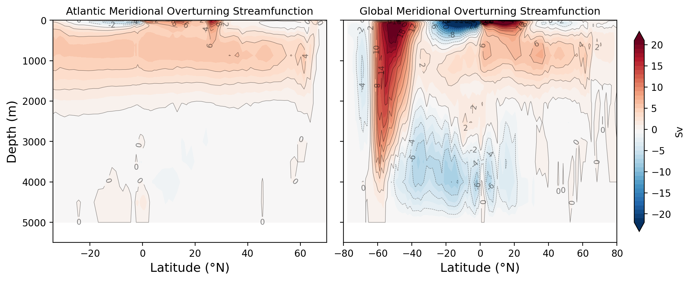

The Atlantic Meridional Overturning Circulation (AMOC) is one of the key diagnostics for ocean models. [CDFTOOLS](https://github.com/meom-group/CDFTOOLS) is a suite of Fortran utilities for analysing NEMO output on its native grid. This post walks through compiling CDFTOOLS, using `cdfmoc` to compute the MOC streamfunction, and plotting the results in Python.

## 1. Compiling CDFTOOLS

CDFTOOLS requires a Fortran compiler and the NetCDF-Fortran library.

### Prerequisites

Make sure NetCDF is available. On an HPC system this is typically done via modules:

```bash
module load netcdf/4.7.4/gcc
```

You can verify the installation with:

```bash
nf-config --fflags
nf-config --flibs
```

### Build

Clone and compile:

```bash
cd $HOME/src
git clone https://github.com/meom-group/CDFTOOLS.git
cd CDFTOOLS
```

Choose and edit the appropriate `Makefile.macro` for your system. The key variables to set are the NetCDF root path, the compiler, and the flags:

```bash
cd src/
ln -sf ../Macrolib/macro.gfortran  make.macro
```

Edit `Makefile.macro` to match your environment. Here is an example for gfortran on an HPC cluster:

```makefile
NCDF_ROOT = /gpfs/software/hali/netcdf/4.7.4/gcc
NCDF = -I$(NCDF_ROOT)/include -L$(NCDF_ROOT)/lib -lnetcdff -lnetcdf

NC4 = -D key_netcdf4

F90 = gfortran
FFLAGS = -O $(NCDF) $(NC4) -fno-second-underscore -ffree-line-length-256

INSTALL = $(HOME)/.local/bin
INSTALL_MAN = $(HOME)/.local/man
```

Then build:

```bash
make all
make install
```

The binaries are placed in `bin/`. Verify the build:

```bash
./bin/cdfmoc --help
```

## 2. Using `cdfmoc`

`cdfmoc` computes the Meridional Overturning Circulation streamfunction from NEMO's grid_V (meridional velocity) output. It integrates meridional velocity zonally and vertically to produce the overturning streamfunction in Sverdrups (Sv, 1 Sv = 10⁶ m³/s).

### Required inputs

- **grid_V file** — NEMO meridional velocity output (e.g. `ORCA2_1m_20000101_20001231_grid_V.nc`)
- **Mask files** — NEMO mesh/mask files. `cdfmoc` expects these filenames in the working directory:
  - `mesh_hgr.nc` — horizontal mesh
  - `mesh_zgr.nc` — vertical mesh
  - `mask.nc` — land/sea mask
  - `new_maskglo.nc` — basin mask (Atlantic, Pacific, Indian, etc.)

If your mesh and mask are combined (e.g. `mesh_mask.nc`), you can symlink them:

```bash
ln -sf mesh_mask.nc mesh_hgr.nc
ln -sf mesh_mask.nc mesh_zgr.nc
ln -sf mesh_mask.nc mask.nc
```

### Running cdfmoc

Basic usage with just the grid_V file, remember to load the netcdf library if start from a fresh session:

```bash
cdfmoc -v grid_V.nc
```

If you also want density-based decomposition, pass the grid_T file:

```bash
cdfmoc -v grid_V.nc -t grid_T.nc
```

This produces `moc.nc` containing the streamfunction variables:
- `zomsfglo` — Global MOC
- `zomsfatl` — Atlantic MOC (this is the AMOC)
- `zomsfpac` — Pacific MOC
- `zomsfinp` — Indo-Pacific MOC

## 3. Plotting the Results

The output `moc.nc` can be read and plotted with Python using xarray and matplotlib.

### Plotting AMOC and GMOC

```python
import xarray as xr
import numpy as np
import matplotlib.pyplot as plt

moc = xr.open_dataset('moc.nc')
depths = -moc['depthw'].values
lats = moc['nav_lat'].values.squeeze()

levels = np.arange(-22, 22, 1)

fig, axes = plt.subplots(1, 2, figsize=(10, 4), layout='constrained', sharey=True)

# AMOC: crop to y=20..130 to avoid tripolar artifacts
atl_yslice = slice(20, 130)
atl = moc['zomsfatl'].squeeze(dim='x').mean(dim='time_counter')
atl_plot = atl.isel(y=atl_yslice).values

cs = axes[0].contourf(lats[atl_yslice], depths, atl_plot,
                      levels=levels, cmap='RdBu_r', extend='both')
cl = axes[0].contour(lats[atl_yslice], depths, atl_plot,
                     levels=levels[::2], colors='k', linewidths=0.4, alpha=0.5)
axes[0].clabel(cl, inline=True, fontsize=8, fmt='%.0f')
axes[0].set_ylim(5500, 0)
axes[0].set_xlim(-34, 70)
axes[0].set_xlabel('Latitude (°N)', fontsize=13)
axes[0].set_ylabel('Depth (m)', fontsize=13)
axes[0].set_title('Atlantic Meridional Overturning Streamfunction', fontsize=11)

# GMOC: use full latitude range (y=1..148 to skip boundary)
glo_yslice = slice(1, 148)
glo = moc['zomsfglo'].squeeze(dim='x').mean(dim='time_counter')
glo_plot = glo.isel(y=glo_yslice).values

cs2 = axes[1].contourf(lats[glo_yslice], depths, glo_plot,
                       levels=levels, cmap='RdBu_r', extend='both')
cl2 = axes[1].contour(lats[glo_yslice], depths, glo_plot,
                      levels=levels[::2], colors='k', linewidths=0.4, alpha=0.5)
axes[1].clabel(cl2, inline=True, fontsize=8, fmt='%.0f')
axes[1].set_xlim(-80, 80)
axes[1].set_xlabel('Latitude (°N)', fontsize=13)
axes[1].set_title('Global Meridional Overturning Streamfunction', fontsize=11)

fig.colorbar(cs, ax=axes.tolist(), pad=0.02, shrink=0.9, label='Sv')

plt.savefig('MOC_streamfunction.png', dpi=200, bbox_inches='tight')
```

This produces side-by-side depth-latitude contour plots of the Atlantic and Global MOC streamfunctions. The AMOC panel is cropped to the Atlantic basin latitudes, while the GMOC panel shows the full meridional extent including the Southern Ocean overturning cells.


